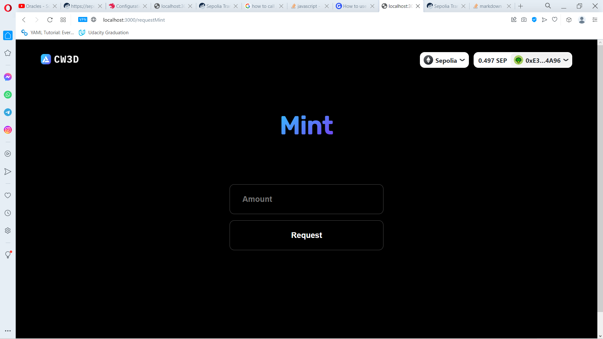
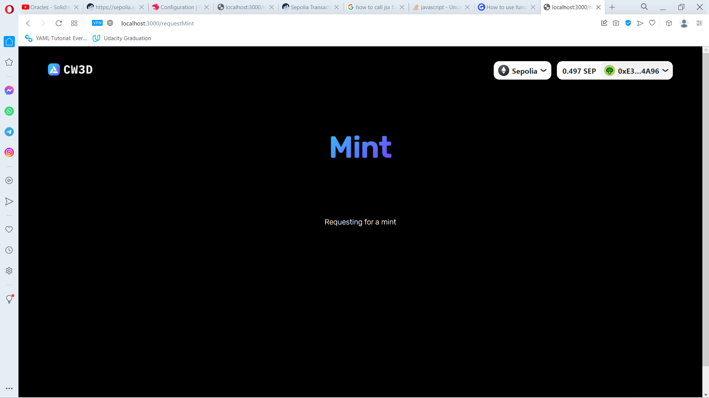
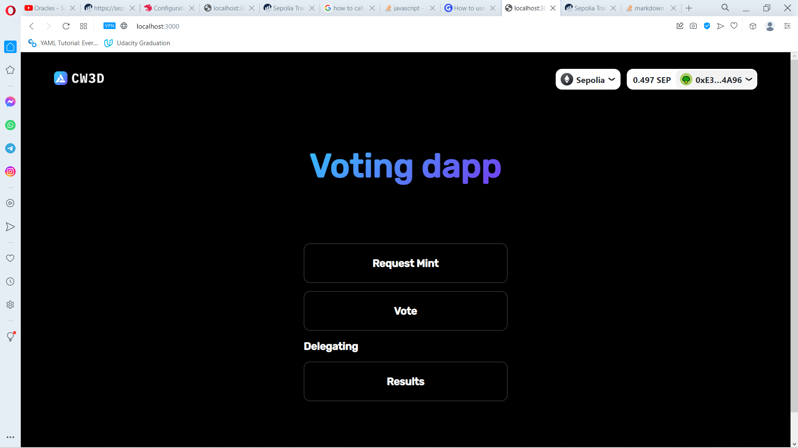
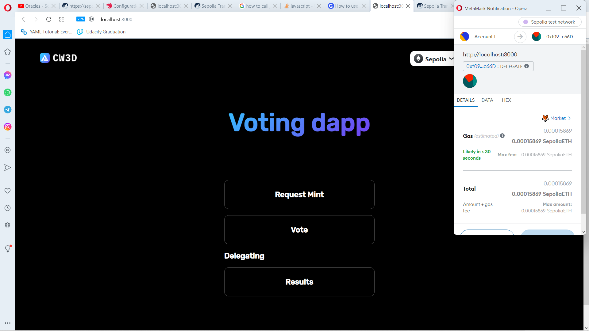
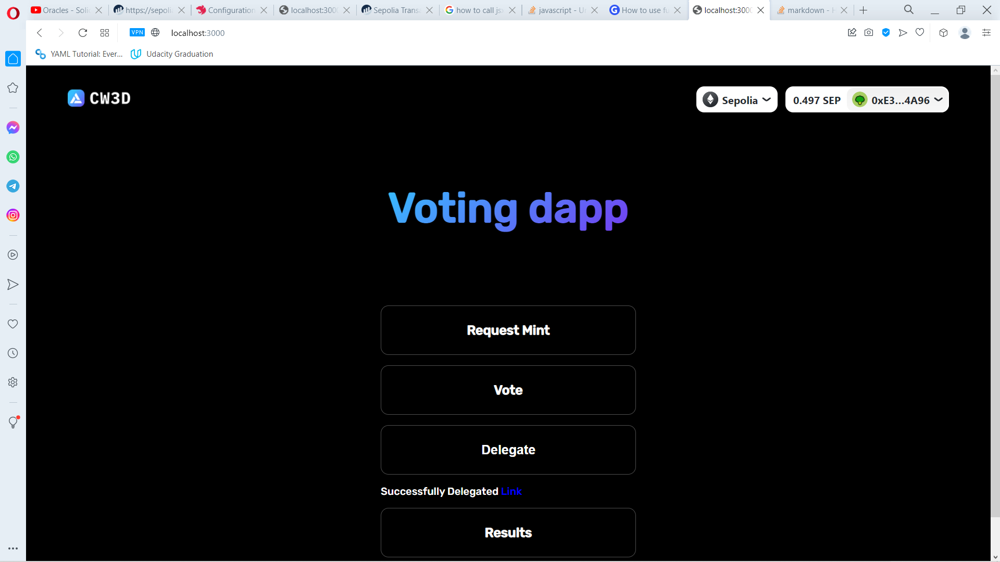
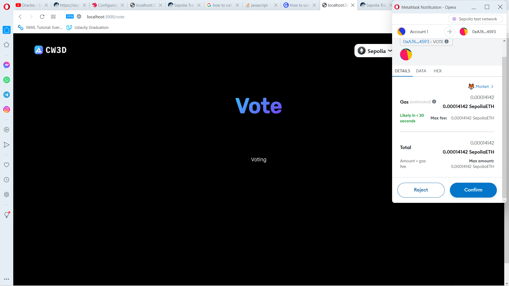
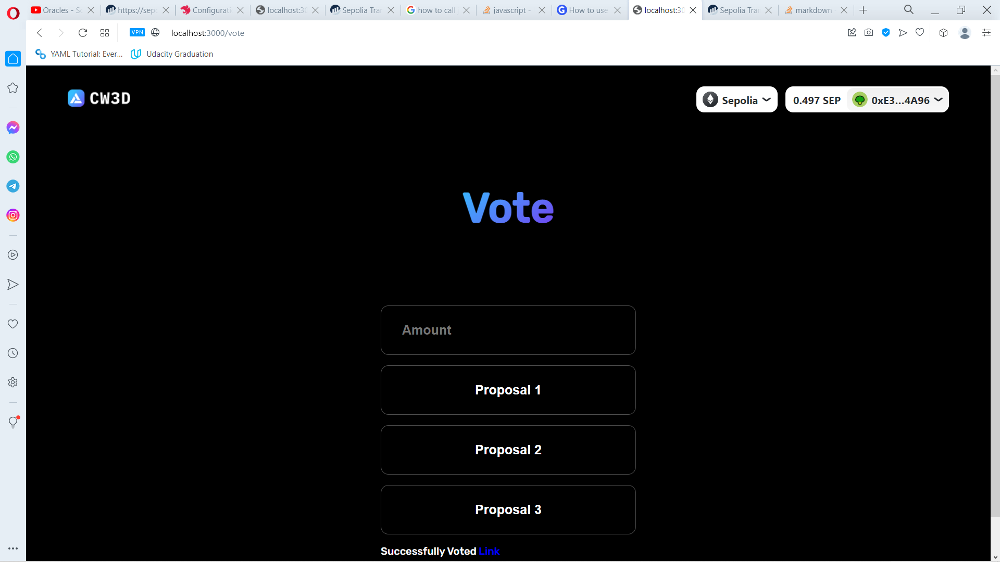
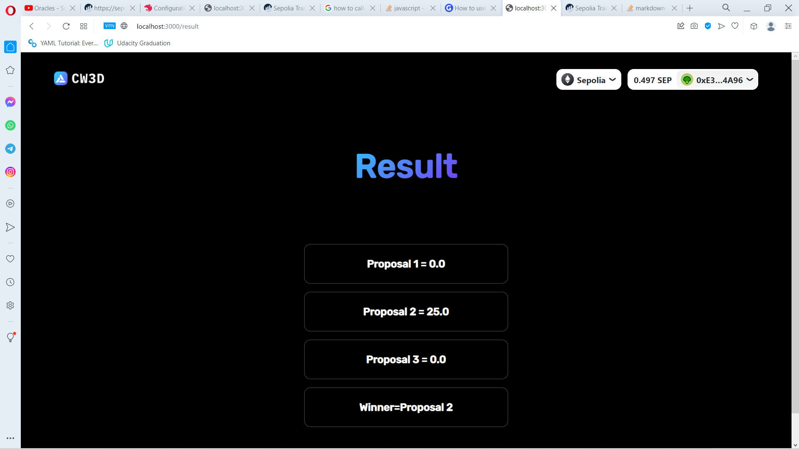

# Voting Dapp

### Mint Request

Transaction Hash: [0xb58fec49fd210dfd93e9e5f4b639bd6490960f8bcd9d3904c7ffa6e9be06c7a7](https://sepolia.etherscan.io/tx/0xb58fec49fd210dfd93e9e5f4b639bd6490960f8bcd9d3904c7ffa6e9be06c7a7 )\

### Delegating

Transaction Hash: [0xba91e71b63d675fc344634fcdce4c796c63c11e5b3d83e9ab959039efd252ff0](https://sepolia.etherscan.io/tx/0xba91e71b63d675fc344634fcdce4c796c63c11e5b3d83e9ab959039efd252ff0 )\

### Voting

Transaction Hash: [0x24cf8f42fe49c39ccc5f7d411422f63d7721233048bd8f86fd7f377f6ea126ef](https://sepolia.etherscan.io/tx/0x24cf8f42fe49c39ccc5f7d411422f63d7721233048bd8f86fd7f377f6ea126ef)\

